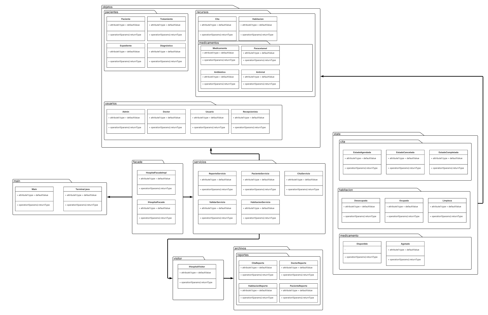
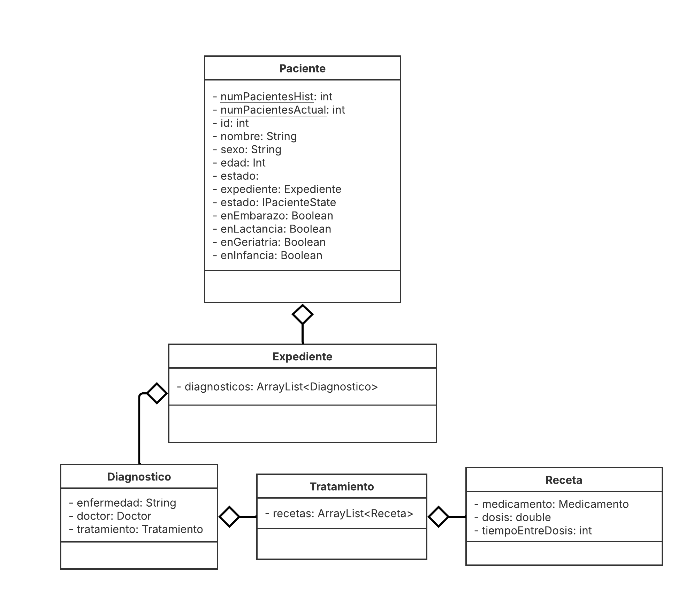
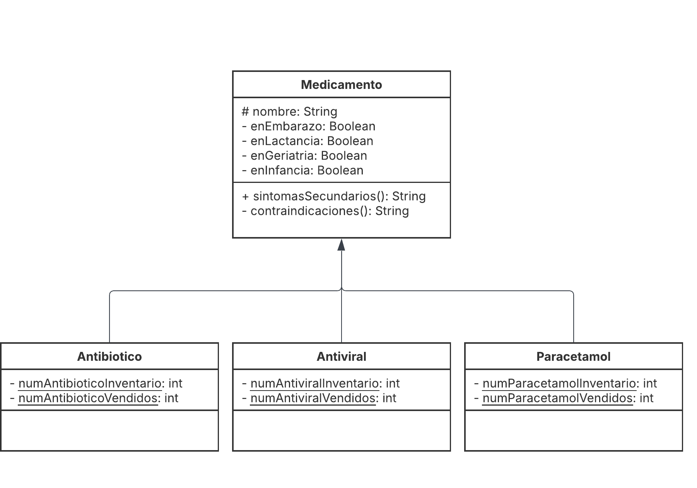
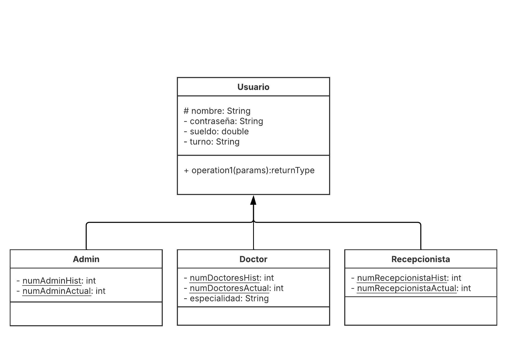

# Final Project - OOP | 2026-1

## Team:

### - Cruz Cardoso André Iván
### - Hidalgo Rodríguez César
### - Serrepe Ramírez Julio Alejandro

## Project: Hospital

## Tipos de usuario:

### - Administrador
### - Médico
### - Recepcionista

## Funcionalidades:

- Gestión de pacientes

    - Registrar
    - Buscar
        - Consultar expedientes clínicos
        - Tratamientos
        - Enfermedades
    - Modificar
        - Mantener actualizado su historial médico
    - Eliminar
    - Dar el alta

- Gestión de médicos
    - Registrar nuevos
    - Información por especialidad o turno (Plantilla)
    - Citas asignadas
    - Modificar su disponibilidad
    - Consultar pacientes atendidos
    - Registrar observaciones médicas (bitácora)

- Gestión de habitaciones y salas
    - Registrar y asignar habitaciones o camas
    - Controlar la disponibilidad de áreas médicas
    - Liberar espacios cuando haya altas

- Gestión de expedientes y diagnósticos
    - Acceso a historlaies médicos, antecedentes y enfermedades (De cada paciente)
    - Generar informes clínicos cuando se requiera

- Reportes y estadísticas
    - El sistema generará informes automáticos sobre:
        - Pacientes
        - Médicos
        - Citas
        - Tratamientos
        - Ocupación hospitalaria (Habitaciones y camas)
    - Mostrará estadísticas generales del hospital como:
        - Número de pacientes atendidos
        - Citas realizadas
        - Porcentaje de ocupación

- Administración del sistema
    - Módulo exclusivo para el administrador:
        - Crear nuevos empleados
        - Otorgar y revocar permisos
        - Realizar respaldos de información y llevar un control general del sistema

- Gestión de Tratamientos y medicamentos
    - Permitirá administrari información de los tratamientos indicados:
        - Dosis
        - Frecuencia
    - Medicamentos disponibles 
    - Control de inventario y evitar faltantes

- Gestión de Citas médicas
    - Agendar, reprogramar o cancelar citar
    - Marcar citas como completadas
    - Cada cita se puede asociar a un diagnóstico o tratamiento
    - Mostrar citas en calendarios por médico o por día

## Diagrama General v1.0

## Diagrama a Detalle (paciente) v1.0

## Diagrama a Detalle (medicamentos) v1.0

## Diagrama a Detalle (usuarios) v1.0

